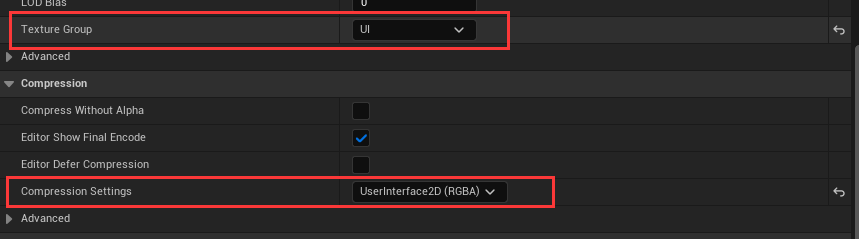

# FairyGUI-unreal5

官方插件地址：https://github.com/fairygui/FairyGUI-unreal 
官方示例地址：https://github.com/fairygui/FairyGUI-unreal-example

这个插件基于FairyGUI官方版本，拥有两个分支。

Offical:
基本上没有做任何逻辑功能上的修改，单纯只是为了能使其在UE5上使用使用了新的API。
仅仅是替换了UE5的API，本着不做过多调整能跑就行的理念进行的分支。

main：
目前我自己项目为了和U3D项目的UI共同采用了FGUI，一切更新优先于我项目遇到的问题。
我在使用时发现很多功能官方并没有实现，例如：GTextInput 的 SetMaxLength 都没有实现，GTextInput 的监听Text变化的Delegate也没有，GetChild在C++中使用每次还得Cast<类型>，等一系列问题，为了修复这些问题main分支就是为此而存在的。
所以main分支就是我在官方插件基础上全新的FairyGUI-unreal5插件

【随缘更新】

如果你使用FairyGUI官方的FairyGUI-unreal-example这个项目来验证该插件，请注意将 Texture 的 CompressionSettings 改为 UserInterface2D（RGBA） 否则会出现图片加载问题（FairyGUI官方UE4项目过旧迁移到UE5这项会失效，所以需要手动调整一次）

